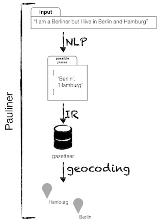

# Pauliner  
*(right now) a naive geoparser*

A rather naive geoparser, but you may be intrigued by its pretentiousness. I use `natural` to tokenize the input, then match NN and NNP against a dump of [Geonames](http://geonames.org) (right now using only German place names).

Lots of things to do, in no particular order:

- spellcheck and suggestions
- confidence rating for matches
- crowdsourcing the accuracy of matches
- more sophisticated NLP ("1 hour south of Göttingen on the autobahn toward Kassel" is not a match for "Göttingen" or "Kassel" but for some place 1 hour drive south of Göttingen in the direction of Kassel)
- capability to add different gazetteers such as GNIS, ODI, Pleiades and others (this would require writing interfaces between gazetteer data formats and the data format that Pauliner understands so that the gazetteers may be easily updated)

See [installing](docs/installing.md)

As usual, everything is in the public domain using the CC0 Public Domain Dedication.
